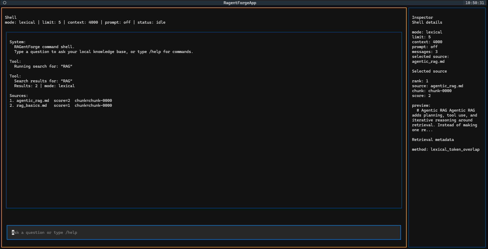
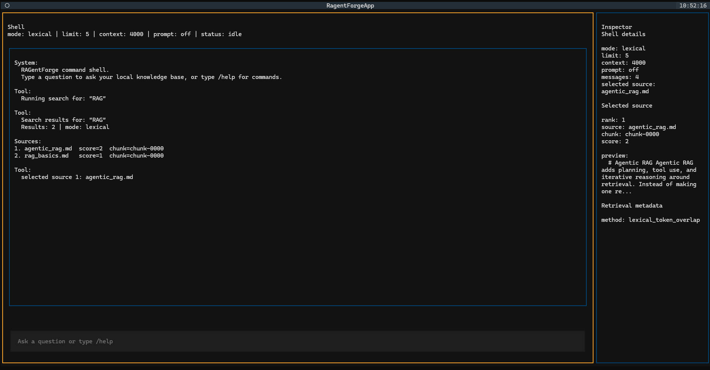
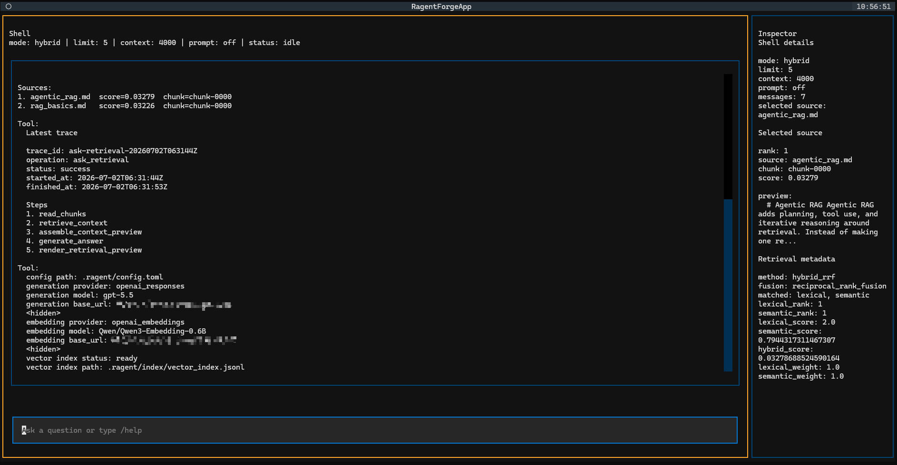
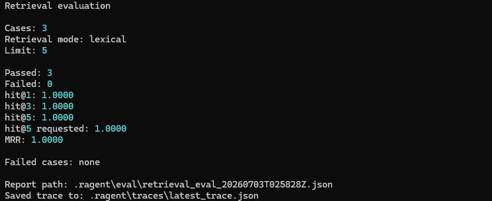

# RAGentForge

> Language: English | [中文](README.zh-CN.md)

RAGentForge is a local-first and inspectable command-first RAG console for
working with Markdown/TXT/PDF knowledge bases from the terminal. It focuses on the
parts of RAG that should be easy to see: what was ingested, how text was
chunked, which sources were retrieved, what prompt was assembled, and what
trace was produced.

## What It Is

RAGentForge is a small Python project for developers who want to understand and
demo an end-to-end retrieval augmented generation workflow without a hosted
service or hidden backend. It stores generated state under a local `.ragent/`
workspace and exposes that state through CLI commands plus a Textual Shell TUI.

It is not a full autonomous agent framework. The current v0.1 surface is a
local, inspectable MVP for ingestion, retrieval, optional generation, traces,
retrieval evaluation, and command-first TUI inspection.

## Why It Exists

Many RAG demos hide the important engineering details behind a hosted app,
framework abstraction, or vector database. RAGentForge keeps the workflow
plain and inspectable so a reader can see the data flow from local documents to
chunks, retrieval results, context packs, answers, sources, traces, and eval
reports.

## Features

- Markdown/TXT ingestion from local files or folders.
- PDF ingestion with page text, table extraction, page ranges, and source
  quality metadata.
- Unified structured ingestion through `DocumentBlock[] -> BlockChunker` for
  Markdown, TXT, and PDF.
- Deterministic chunking into JSONL records with format-aware metadata.
- Local workspace storage under `.ragent/`.
- Lexical retrieval over generated chunks.
- OpenAI-compatible embedding configuration for semantic retrieval.
- Local JSONL vector index for semantic search.
- Hybrid retrieval with Reciprocal Rank Fusion over lexical and semantic
  candidates.
- Ask pipeline with optional OpenAI Responses-compatible generation.
- Retrieval-only Ask mode when generation is not configured.
- Source-grounded answers and compact source displays.
- Local operation traces for CLI ingest, index build, search, ask, and
  retrieval eval workflows.
- Retrieval evaluation with hit@k and MRR.
- Command-first Textual TUI Shell with command suggestions, source navigation,
  and an Inspector panel.

## Quickstart

Install development dependencies:

```bash
uv sync --extra dev
```

Prepare the sample workspace:

```bash
uv run ragent ingest examples/knowledge --workspace .ragent
uv run ragent status --workspace .ragent
uv run ragent chunks list --workspace .ragent
```

Inspect a chunk and its structured metadata:

```bash
uv run ragent chunks show "<chunk_id>" --workspace .ragent
```

Run lexical retrieval:

```bash
uv run ragent search "What is RAG?" --retrieval lexical --workspace .ragent
uv run ragent ask "What is Agentic RAG?" --retrieval lexical --workspace .ragent
```

Launch the command-first TUI from the project root:

```bash
uv run ragent tui
```

The TUI currently reads the default `.ragent` workspace in the current working
directory. Use the CLI for ingest, index build, eval, and config editing.

## End-to-End Demo

For the reproducible demo flow, see
[docs/PROJECT_WALKTHROUGH.md](docs/PROJECT_WALKTHROUGH.md).

For the structured ingestion branch demo, see
[docs/STRUCTURED_INGESTION_DEMO.md](docs/STRUCTURED_INGESTION_DEMO.md).

The short version:

```bash
uv run ragent ingest examples/knowledge --workspace .ragent
uv run ragent chunks list --workspace .ragent
uv run ragent search "What is Agentic RAG?" --retrieval lexical --workspace .ragent
uv run ragent ask "What is Agentic RAG?" --retrieval lexical --workspace .ragent
uv run ragent traces latest --workspace .ragent
uv run ragent eval retrieval --cases examples/eval/retrieval_cases.jsonl --retrieval lexical --workspace .ragent
uv run ragent tui
```

To generate retrieval eval cases from the source documents first, initialize
config if needed, set `[generation] provider = "openai_responses"` in
`.ragent/config.toml`, dry-run span extraction, write the generated JSONL, then
run retrieval eval against the same ingested workspace:

```bash
uv run ragent config init --workspace .ragent
uv run ragent ingest examples/knowledge --workspace .ragent
uv run ragent eval generate --source examples/knowledge --workspace .ragent --output .ragent/eval/generated_cases.jsonl --questions-per-span 2 --max-cases 10 --dry-run
uv run ragent eval generate --source examples/knowledge --workspace .ragent --output .ragent/eval/generated_cases.jsonl --questions-per-span 2 --max-cases 10 --overwrite
uv run ragent eval retrieval --cases .ragent/eval/generated_cases.jsonl --workspace .ragent --retrieval lexical --limit 5
```

`eval generate --dry-run` does not call a model. Without `--dry-run`,
`eval generate` extracts evidence spans directly from Markdown/TXT source files
and calls the configured generation provider. Add `--include-pdf` when the
source includes text-based PDFs. `eval retrieval` then maps those evidence spans
back to the current workspace chunks, so run `ragent ingest` on the same source
documents before evaluating.

Semantic and hybrid retrieval require an embedding provider in
`.ragent/config.toml` and a built vector index:

```bash
uv run ragent config init --workspace .ragent
uv run ragent index build --workspace .ragent
uv run ragent index status --workspace .ragent
uv run ragent search "What is Agentic RAG?" --retrieval semantic --workspace .ragent
uv run ragent search "What is Agentic RAG?" --retrieval hybrid --workspace .ragent
```

With the default config, generation uses the `null` provider. In that mode
`ragent ask` retrieves and displays context but does not call a model.

## Screenshots

TUI Shell search with compact source results:



Selected-source Inspector after source navigation:



Trace and settings inspection in the TUI:



Retrieval evaluation output:



## Command-First TUI

`uv run ragent tui` opens a single Shell interface with a transcript, composer,
status line, inline command suggestions, and selected-source Inspector.

Ordinary text and `/ask <question>` run Shell Ask in a background worker.
`/search <query>` runs Shell Search in a background worker. The Shell reads
existing workspace chunks and indexes; it does not run ingest, build the
semantic index, run retrieval eval, or edit config.

Useful Shell commands:

```text
/help
/mode lexical|semantic|hybrid
/limit <n>
/context <n>
/prompt on|off
/search <query>
/ask <question>
/sources
/source <rank>
/source next
/source prev
/docs
/trace
/settings
/config
/clear
/exit
/quit
/q
```

Shell source navigation:

```text
/sources
/source <rank>
/source next
/source prev
```

Typing `/` opens inline command candidates. Use Up/Down to choose a command,
then Tab or Enter to complete it into the composer. Command execution still
happens through composer text.

The TUI intentionally avoids global single-key shortcuts such as `q` to quit.
Use `/exit`, `/quit`, or `/q` from the composer.

Shell Ask does not write new traces in v0.1. CLI `uv run ragent ask ...`
remains the trace-producing Ask workflow. Shell `/trace` reads the latest trace
already written by CLI workflows.

## Architecture

The project is organized around presentation layers, application services,
focused core modules, and local workspace storage. The high-level pipeline is:

```text
local documents
-> ingest
-> structured loaders
-> Document + DocumentBlock[]
-> BlockChunker
-> deterministic chunks
-> lexical / semantic / hybrid retrieval
-> context pack
-> optional generation
-> answer + sources
-> traces
-> retrieval eval
-> command-first TUI inspection
```

Read the full architecture note:
[docs/ARCHITECTURE.md](docs/ARCHITECTURE.md).

The structured ingestion branch design note is here:
[docs/STRUCTURED_INGESTION_DESIGN.md](docs/STRUCTURED_INGESTION_DESIGN.md).

The TUI design note is here:
[docs/TUI_COMMAND_SHELL_DESIGN.md](docs/TUI_COMMAND_SHELL_DESIGN.md).

## Project Scope

The current scope is documented in
[docs/V0_1_SCOPE.md](docs/V0_1_SCOPE.md).

v0.1 includes local ingestion, deterministic chunks, lexical retrieval,
semantic retrieval, hybrid RRF retrieval, optional generation, source display,
traces, retrieval evaluation, and a command-first TUI Shell.

The `Develop_PDF` branch adds the v0.1-alpha-1 PDF and structured ingestion
work: PDF page/table ingestion, extraction quality polish, and a unified
`DocumentBlock` foundation for Markdown, TXT, and PDF.

## Release and Portfolio Materials

- [v0.1 Demo Script](docs/DEMO_SCRIPT.md)
- [v0.1 Release Notes](docs/RELEASE_NOTES_V0_1.md)
- [v0.1-alpha-1 Structured Ingestion Release Notes](docs/RELEASE_NOTES_V0_1_ALPHA_1.md)
- [Structured Ingestion Demo Workflow](docs/STRUCTURED_INGESTION_DEMO.md)
- [Structured Ingestion Design](docs/STRUCTURED_INGESTION_DESIGN.md)
- [Portfolio Summary](docs/PORTFOLIO_SUMMARY.md)

## Current Limitations

RAGentForge v0.1 intentionally does not include BM25, reranking,
cross-encoder reranking, LLM-as-judge, answer evaluation, query expansion,
multi-turn memory, agent tool loops, planning loops, OCR/scanned PDF support,
PDF viewing/editing, web UI, vector
databases, streaming, session persistence, or TUI write operations such as
ingest/index/eval/config editing.

Semantic and hybrid retrieval require a vector index. Generation depends on a
configured OpenAI Responses-compatible provider; otherwise Ask stays in
retrieval-only mode.

## Roadmap

Future versions may add better retrieval quality, answer evaluation,
explicitly controlled agent layers, richer source inspection, and more polished
developer ergonomics. These are future directions, not current v0.1 features.

More context:

- [docs/ARCHITECTURE.md](docs/ARCHITECTURE.md)
- [docs/PROJECT_WALKTHROUGH.md](docs/PROJECT_WALKTHROUGH.md)
- [docs/V0_1_SCOPE.md](docs/V0_1_SCOPE.md)
- [docs/TUI_COMMAND_SHELL_DESIGN.md](docs/TUI_COMMAND_SHELL_DESIGN.md)
- [docs/STRUCTURED_INGESTION_DESIGN.md](docs/STRUCTURED_INGESTION_DESIGN.md)
- [docs/STRUCTURED_INGESTION_DEMO.md](docs/STRUCTURED_INGESTION_DEMO.md)
- [docs/DEMO_SCRIPT.md](docs/DEMO_SCRIPT.md)
- [docs/RELEASE_NOTES_V0_1.md](docs/RELEASE_NOTES_V0_1.md)
- [docs/RELEASE_NOTES_V0_1_ALPHA_1.md](docs/RELEASE_NOTES_V0_1_ALPHA_1.md)
- [docs/PORTFOLIO_SUMMARY.md](docs/PORTFOLIO_SUMMARY.md)
