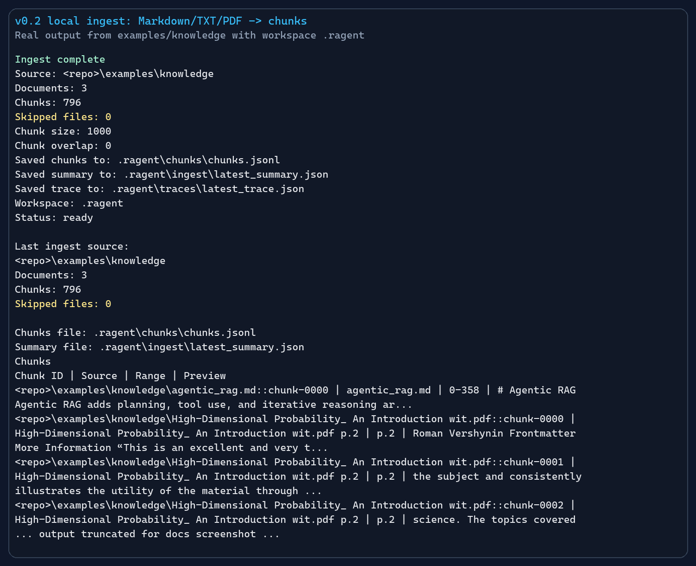
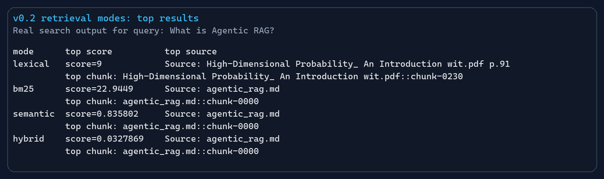
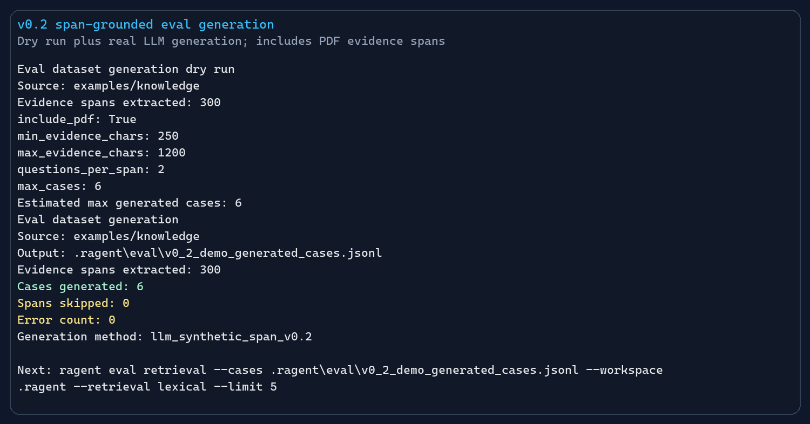
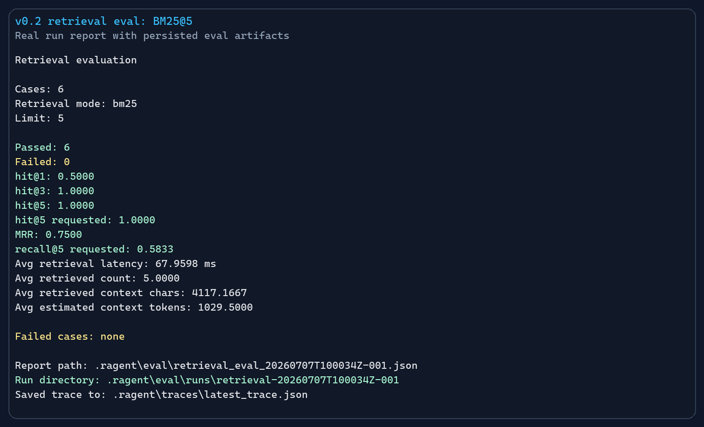
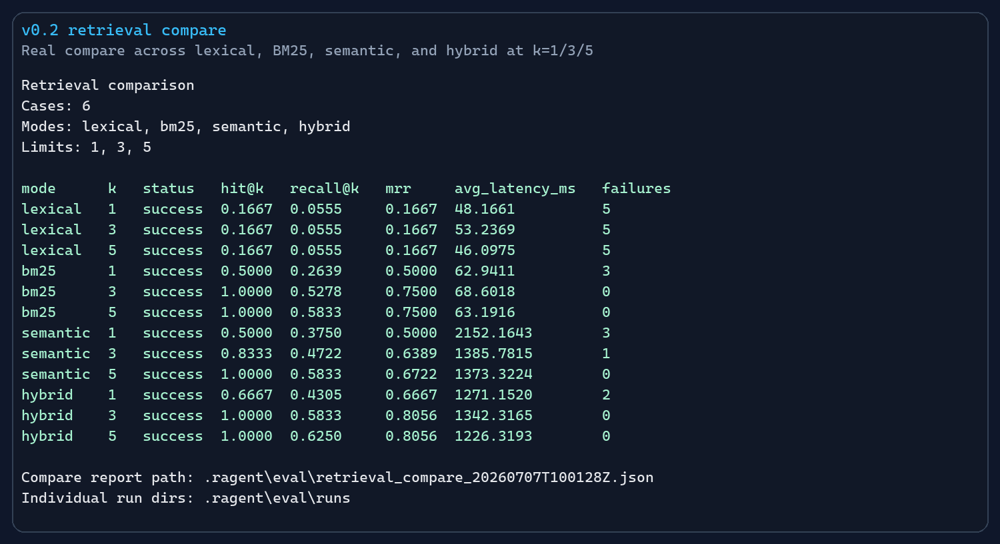
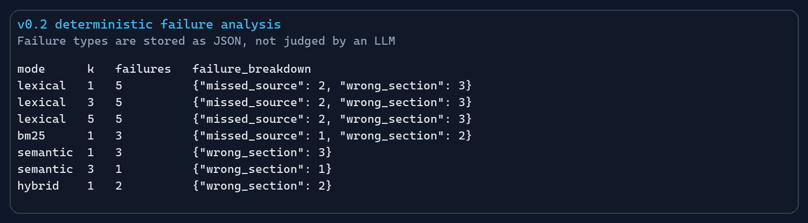
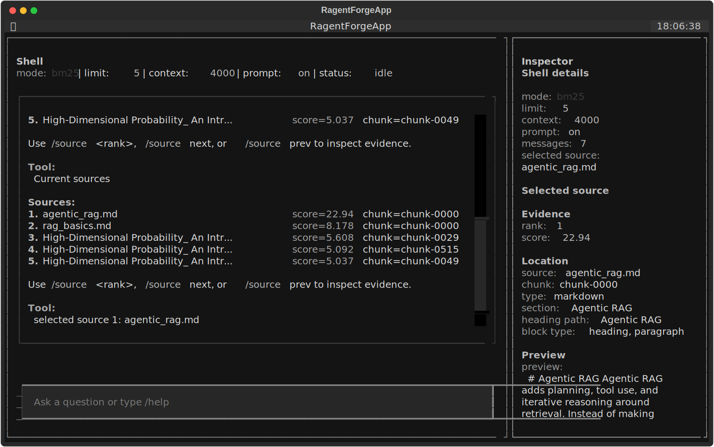

# RAGentForge v0.2 Demo Results

> Language: English | [中文](V0_2_DEMO_RESULTS.zh-CN.md)

This page records one real local v0.2 demo run. The numbers below came from
the local workspace on the stated commit; they are not benchmark claims and
should be refreshed when the corpus, chunking, provider, or retrieval code
changes.

The screenshots are rendered from real command output with absolute local paths
normalized to `<repo>`. The TUI screenshot is exported by Textual from the
running app.

## Environment

| Field | Value |
|---|---|
| Date | `2026-07-07` |
| Git commit | `dc42972` |
| Python | `3.12.11` |
| OS | `Microsoft Windows NT 10.0.26200.0` |
| Workspace | `.ragent` |
| Corpus | `examples/knowledge` |
| Corpus contents | 2 Markdown files, 1 text-based PDF |
| Generation provider | `openai_responses`, model `gpt-5.5` |
| Embedding provider | `openai_embeddings`, model `Qwen/Qwen3-Embedding-0.6B` |

Current local corpus note: this run covers Markdown and PDF files from
`examples/knowledge`. TXT ingestion is part of the current implementation, but
this particular local corpus did not contain a `.txt` file.

## Screenshots

| Screenshot | What It Shows |
|---|---|
|  | Mixed local corpus ingest, status, and chunk listing with PDF page labels. |
|  | Top result comparison for lexical, BM25, semantic, and hybrid retrieval. |
|  | Span-grounded dry run plus real synthetic eval generation. |
|  | BM25@5 retrieval evaluation with persisted report paths. |
|  | Retrieval compare across modes and top-k limits. |
|  | Deterministic failure types from compare runs. |
|  | Command-first TUI with BM25 search, source inspection, and prompt preview enabled. Current main also includes streaming Ask, saved sessions, source/session pickers, clean chat transcript badges, queued drafts, and actionable failure messages. |

## 1. Prepare Workspace

Commands:

```bash
uv run ragent ingest examples/knowledge --workspace .ragent
uv run ragent status --workspace .ragent
uv run ragent chunks list --workspace .ragent --limit 10
```

Observed output summary:

```text
Ingest complete
Documents: 3
Chunks: 796
Skipped files: 0
Chunk size: 1000
Chunk overlap: 0
Workspace: .ragent
Status: ready
```

Chunk listing confirmed:

- Markdown chunks from `agentic_rag.md`.
- Markdown chunks from `rag_basics.md`.
- PDF chunks from `High-Dimensional Probability_ An Introduction wit.pdf`.
- PDF chunks display page-aware source labels such as `p.2`, `p.3`, and `p.4`.

## 2. Retrieval Mode Smoke Test

Commands:

```bash
uv run ragent search "What is Agentic RAG?" --retrieval lexical --workspace .ragent
uv run ragent search "What is Agentic RAG?" --retrieval bm25 --workspace .ragent
uv run ragent index build --workspace .ragent
uv run ragent search "What is Agentic RAG?" --retrieval semantic --workspace .ragent
uv run ragent search "What is Agentic RAG?" --retrieval hybrid --workspace .ragent
```

Top result by mode:

| Mode | Top Source | Top Chunk | Score |
|---|---|---|---:|
| lexical | `High-Dimensional Probability_ An Introduction wit.pdf p.91` | `chunk-0230` | `9` |
| bm25 | `agentic_rag.md` | `chunk-0000` | `22.9449` |
| semantic | `agentic_rag.md` | `chunk-0000` | `0.835802` |
| hybrid | `agentic_rag.md` | `chunk-0000` | `0.0327869` |

Interpretation:

- Lexical token overlap is easily distracted by the much larger PDF corpus.
- BM25, semantic, and hybrid all put the intended `agentic_rag.md` chunk first.
- Hybrid combines BM25 and semantic signals; it does not require the user to
  choose a single sparse or dense retriever at query time.

## 3. Span-Grounded Eval Generation

Commands:

```bash
uv run ragent eval generate --source examples/knowledge --workspace .ragent --output .ragent/eval/v0_2_demo_generated_cases.jsonl --questions-per-span 2 --max-cases 6 --include-pdf --dry-run
uv run ragent eval generate --source examples/knowledge --workspace .ragent --output .ragent/eval/v0_2_demo_generated_cases.jsonl --questions-per-span 2 --max-cases 6 --include-pdf --overwrite
```

Observed generation output:

| Field | Value |
|---|---:|
| Evidence spans extracted | `300` |
| include_pdf | `True` |
| questions_per_span | `2` |
| max_cases | `6` |
| Cases generated | `6` |
| Spans skipped | `0` |
| Error count | `0` |

Generated case composition:

| Field | Value |
|---|---|
| Output file | `.ragent/eval/v0_2_demo_generated_cases.jsonl` |
| Case IDs | `synthetic-span-000001` through `synthetic-span-000006` |
| Question types | 5 factual, 1 comparison |
| Difficulty | 5 easy, 1 medium |
| Evidence media | 4 PDF evidence spans, 2 Markdown evidence spans |
| Generation method | `llm_synthetic_span_v0.2` |

Generated questions:

| Case | Question |
|---|---|
| `synthetic-span-000001` | What does Agentic RAG add on top of basic retrieval and generation? |
| `synthetic-span-000002` | How is an agentic RAG workflow different from a simple one-shot RAG workflow? |
| `synthetic-span-000003` | Who wrote the high-dimensional probability book mentioned in the evidence? |
| `synthetic-span-000004` | What background does the text assume before introducing high-dimensional probability? |
| `synthetic-span-000005` | Who is the author of the book High-Dimensional Probability? |
| `synthetic-span-000006` | What kinds of students is this book described as useful for in a graduate course? |

## 4. Retrieval Eval

Command:

```bash
uv run ragent eval retrieval --workspace .ragent --cases .ragent/eval/v0_2_demo_generated_cases.jsonl --retrieval bm25 --limit 5
```

Report artifacts:

| Artifact | Path |
|---|---|
| Compatibility report | `.ragent/eval/retrieval_eval_20260707T100034Z-001.json` |
| Run directory | `.ragent/eval/runs/retrieval-20260707T100034Z-001` |
| Summary JSON | `.ragent/eval/runs/retrieval-20260707T100034Z-001/summary.json` |
| Summary Markdown | `.ragent/eval/runs/retrieval-20260707T100034Z-001/summary.md` |
| Cases JSONL | `.ragent/eval/runs/retrieval-20260707T100034Z-001/cases.jsonl` |
| Failures JSONL | `.ragent/eval/runs/retrieval-20260707T100034Z-001/failures.jsonl` |

BM25@5 metrics:

| Metric | Value |
|---|---:|
| cases | `6` |
| passed | `6` |
| failed | `0` |
| hit@1 | `0.5000` |
| hit@3 | `1.0000` |
| hit@5 | `1.0000` |
| hit@k | `1.0000` |
| recall@k | `0.5833` |
| mrr | `0.7500` |
| avg_retrieval_latency_ms | `67.9598` |
| avg_retrieved_count | `5.0000` |
| avg_retrieved_context_chars | `4117.1667` |
| avg_estimated_context_tokens | `1029.5000` |

Failure analysis:

| Failure Type | Count | Notes |
|---|---:|---|
| none | `0` | `failures.jsonl` was empty for BM25@5. |

## 5. Retrieval Compare

Command:

```bash
uv run ragent eval compare --workspace .ragent --cases .ragent/eval/v0_2_demo_generated_cases.jsonl --retrieval lexical,bm25,semantic,hybrid --limit 1,3,5
```

Compare output:

| Retrieval | k | Status | Hit@k | Recall@k | MRR | Avg Latency ms | Failures |
|---|---:|---|---:|---:|---:|---:|---:|
| lexical | 1 | success | `0.1667` | `0.0555` | `0.1667` | `48.1661` | `5` |
| lexical | 3 | success | `0.1667` | `0.0555` | `0.1667` | `53.2369` | `5` |
| lexical | 5 | success | `0.1667` | `0.0555` | `0.1667` | `46.0975` | `5` |
| bm25 | 1 | success | `0.5000` | `0.2639` | `0.5000` | `62.9411` | `3` |
| bm25 | 3 | success | `1.0000` | `0.5278` | `0.7500` | `68.6018` | `0` |
| bm25 | 5 | success | `1.0000` | `0.5833` | `0.7500` | `63.1916` | `0` |
| semantic | 1 | success | `0.5000` | `0.3750` | `0.5000` | `2152.1643` | `3` |
| semantic | 3 | success | `0.8333` | `0.4722` | `0.6389` | `1385.7815` | `1` |
| semantic | 5 | success | `1.0000` | `0.5833` | `0.6722` | `1373.3224` | `0` |
| hybrid | 1 | success | `0.6667` | `0.4305` | `0.6667` | `1271.1520` | `2` |
| hybrid | 3 | success | `1.0000` | `0.5833` | `0.8056` | `1342.3165` | `0` |
| hybrid | 5 | success | `1.0000` | `0.6250` | `0.8056` | `1226.3193` | `0` |

Compare artifacts:

| Artifact | Path |
|---|---|
| Compare report | `.ragent/eval/retrieval_compare_20260707T100128Z.json` |
| Individual run directories | `.ragent/eval/runs/` |

Failure breakdown from compare runs:

| Retrieval | k | Failures | Failure Breakdown |
|---|---:|---:|---|
| lexical | 1 | `5` | `missed_source: 2`, `wrong_section: 3` |
| lexical | 3 | `5` | `missed_source: 2`, `wrong_section: 3` |
| lexical | 5 | `5` | `missed_source: 2`, `wrong_section: 3` |
| bm25 | 1 | `3` | `missed_source: 1`, `wrong_section: 2` |
| semantic | 1 | `3` | `wrong_section: 3` |
| semantic | 3 | `1` | `wrong_section: 1` |
| hybrid | 1 | `2` | `wrong_section: 2` |

Interpretation:

- For this local run, `hybrid@5` had the highest recall@k (`0.6250`) and MRR
  (`0.8056`) while still passing all 6 cases.
- `bm25@3` and `bm25@5` also passed all 6 cases and were much faster than
  semantic/hybrid because they did not call the embedding search path.
- Lexical remained a useful baseline, but it struggled on this mixed corpus
  because the large PDF contributed many high-overlap distractor chunks.

## 6. TUI Smoke Check

The TUI screenshot was captured with Textual's `save_screenshot` API after
launching `RagentForgeApp` against `.ragent` and submitting these commands:

```text
/mode bm25
/search What is Agentic RAG?
/sources
/source 1
/prompt on
```

Observed checks:

| Check | Result | Notes |
|---|---|---|
| TUI launches | pass | Textual test harness opened `RagentForgeApp`. |
| BM25 mode is selectable | pass | Status changed to `mode: bm25`. |
| Search completes | pass | BM25 search returned sources from local chunks. |
| Source picker opens | pass | Search results can be selected from a focused source picker. |
| Sources are navigable | pass | `/source 1` selected the first source. |
| Inspector shows selected source | pass | Inspector showed selected source details. |
| Prompt preview toggles | pass | `/prompt on` enabled prompt preview in the shell state. |

For current `main`, extend the TUI smoke pass with session-workbench commands:

```text
What is Agentic RAG?
/turn last
/sessions
/sessions pinned
/sessions failed
/sessions has-sources
/rename v0.2 demo session
/pin
/star
/export markdown
```

Expected current-main checks:

| Check | Expected result |
|---|---|
| Ordinary text asks by default | The user question is saved as a session turn. |
| Answer streams when provider supports it | Assistant text appears incrementally in the transcript. |
| Transcript stays chat-focused | Assistant replies use lightweight badges such as `[1 source]` or `[failed]`; source details stay in the picker/Inspector. |
| Session picker is keyboard usable | Enter switches to the highlighted session and focus returns to the composer. |
| Session filters work | `/sessions pinned`, `/sessions failed`, and `/sessions has-sources` narrow the picker. |
| Session metadata persists | The session JSON under `.ragent/sessions/` records title, pin/star state, turns, sources, and run metadata. |
| Session export writes a file | `/export markdown` writes under `.ragent/sessions/exports/`. |
| Running draft stays editable | Submitting while running reports `1 draft queued`, then `1 draft ready`. |
| Worker errors are actionable | Failure messages point to `/settings`, `/docs`, or `/mode bm25` instead of stack traces. |

## Final Notes

- Best quality mode in this local run: `hybrid@5`, based on recall@k and MRR.
- Best fast sparse mode in this local run: `bm25@5`, based on all cases passing
  with much lower latency than semantic/hybrid.
- Most useful failure types: `missed_source` and `wrong_section`.
- Dataset cleanup note: the generated dataset is small (`6` cases) and useful
  for a demo, not a benchmark.
- Retrieval improvement note: the lexical baseline is weak on this corpus
  because exact token overlap is distracted by a large PDF; BM25 is a better
  sparse default for mixed local corpora.
